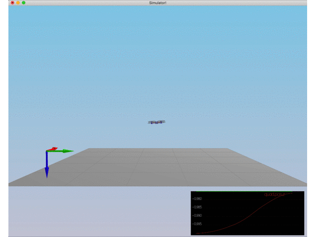
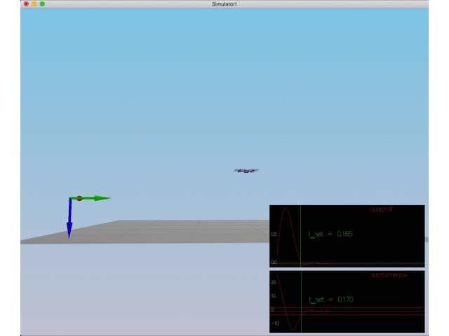
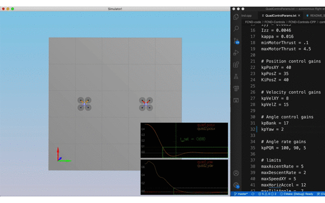
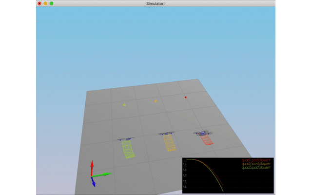

# The C++ Project Submission Notes #
Here, each rubric item (https://review.udacity.com/#!/rubrics/1643/view) along with provided solution implementation details will be outlined.

The first tuning done in this project is the adjust the weight of the drone. Here is the outcome of this fine-tuning of drone mass.



## Implemented body rate control in C++
Body rate controller is implemented in the following method in `QuadControl.cpp`
```code
V3F QuadControl::BodyRateControl(V3F pqrCmd, V3F pqr)
{

}
```
First, we compute angular accelerations around x, y, and z axis. Next, we use the moment of inertia of the drone around x, y, and z axis to compute the desired moment command.

## Implement roll pitch control in C++
Roll pitch controller code can be found in the following method in `QuadControl.cpp`
```code
V3F QuadControl::RollPitchControl(V3F accelCmd, Quaternion<float> attitude, float collThrustCmd)
{

}
```
As the name of the method suggests, this method contains derivation of roll and pitch angles using desired global lateral acceleration, current estimated vehicle attitude, and desired collective thrust of the vehicle (in N). First, we convert the collective thrust in Newtons to acceleration using the mass of the vehicle. We need to constrain the title angle in the range [-maxTiltAngle, maxTiltAngle]. Later on we use the pitch/roll gain `kpBank` and elements of the rotation matrix `R` to derive the desired roll and pitch commands. The yaw component is kept at zero as we will implement a separate control loop for yaq control.

After implementing both the above mentioned methods and tuning the roll and bank parameters, here is the simulation of the drone passing the test.



## Implement altitude controller in C++
Altitude controller code can found with the following method in `QuadControl.cpp`
```code
float QuadControl::AltitudeControl(float posZCmd, float velZCmd, float posZ, float velZ, Quaternion<float> attitude, float accelZCmd, float dt)
{

}
```
This method will compute and return the desired collective thrust to be commanded to the drone. We need to constrain the vertical velocity of the drone to [-maxAscentRate, maxDescentRate]. Since we are given NED coordinates, maxDescentRate is downwards and hence +ve sign while maxAscentRate is upwards with -ve sign. We constrain the vertical commanded velocity `velZCmd` to be [-maxAscentRate, maxDescentRate]. For implementing PID controller, we need to integrate error over time. This is done using the `integratedAltitudeError` variable and time elapsed `dt` as shown in the method. Control input `u1_bar` is computed using the position error and `kpPosZ`, acceleration error and `kpVelZ`, integrated error and `KiPosZ`. Final collective thrust is computed using all forces acting on the drone, i.e., `u1_bar` and `CONST_GRAVITY` constrained by maximum thrust for each motor.

## Implement lateral position control in C++
Lateral position controller is responsible for generating local desired/commanded acceleration in the local frame. A PD controller with feed-forward term is used for generating local acceleration commands. The code for lateral position control is in the following method in `QuadControl.cpp`.

```code
V3F QuadControl::LateralPositionControl(V3F posCmd, V3F velCmd, V3F pos, V3F vel, V3F accelCmdFF)
{

}
```

The difference between commanded position/velocity and actual position/velocity is scaled by position and velocity control gains (`kpPosXY` and `kpVelXY`). Feed-forward acceleration is used along with the scaled position and velocity errors to compute the desired accelerations in x and y directions. The computed acceleration is then constrained to be within the allowed horizontal acceleration for the drone [-maxAccelXY, maxAccelXY]. The resultant constrained accelerations in x and y directions are returned.

## Implement yaw control in C++
Yaw controller is implemented in the following method in `QuadControl.cpp`.

```code
float QuadControl::YawControl(float yawCmd, float yaw)
{

}
```

We ensure that that the commanded yaw is in the range of 0-360 degrees (using radians in the code). Desired yaw and current yaw compared to compute the yaw error. Later, the yaw error is made to have appropriate sign and range and scaled with controller yaw gain `kpYaw` to compute the yaw command.

## Implement calculating the motor commands given commanded thrust and moments in C++
Motor commands for each individual motor is derived using desired collective thrust and desired moments around x, y, z axis. 

```code
VehicleCommand QuadControl::GenerateMotorCommands(float collThrustCmd, V3F momentCmd)
{

}
```

We have four equations and four unknowns when we write up all the torques and collective thrusts in terms of motor forces (F1, F2, F3, F4). The derived equations are implemented in the source code for the above method. We need to constrain the desired thrust for each motor to be in the range [minMotorThrust, maxMotorThrust] which limits the total collective thrust to be 4 * maxMotorThrust.

After implementing all the methods above and fine-tuning the controller gains, here is the working of the drone for scenario 3 where two drones are commanded to move a desired position. 


After tuning the controller grain `KiPosZ` for the PID controller for altitude, the solution for `Non-idealities and robustness` is shown below.



## Your C++ controller is successfully able to fly the provided test trajectory and visually passes inspection of the scenarios leading up to the test trajectory
With the same controller gain setting obtained by tuning for various scenarios, further tuning resulted in close trajectory tracking as shown here for the yellow quad.


## Observations
* Implementation of each controller was relatively clear with occasional confusion with the sign of terms. Later, by flipping back and forth and using NED frame reference, was able to fix signs
* Constraining quantities is absolutely essential and sometimes without this, I was stuck with seemingly unrelated problems like the quad flying away vertically
* When there is an issue observed with the quad, it's hard to distinguish between implementation error and the tuning errors. Sometimes when the drone was completely off it's behavior, I had to fix bugs with the implementation. For finer behavioral deviation, had to fine-tune the controller gains